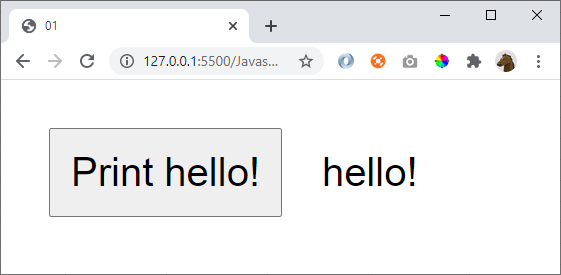

# 01

When the button is pressed, show the text "hello"

## Hint

To create a button

    <button onclick="someFunction()">My button text</button>

To change content of an element

    document.getElementById("myHtmlObjectId").innerText = "Some text to insert"

## Extra

Display the text upside and down