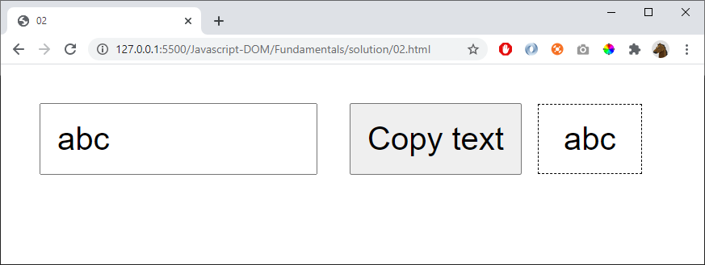

# 02

When the button is pressed, copy the text to the left to the area in the right

## Hint

Get value of an input tag:

    let myVariable = document.getElementById("myElementId").value

## Extra

1) Give error message (or red border) if no text is written

2) Give a message if the button is pressed when the text already shows the copied text