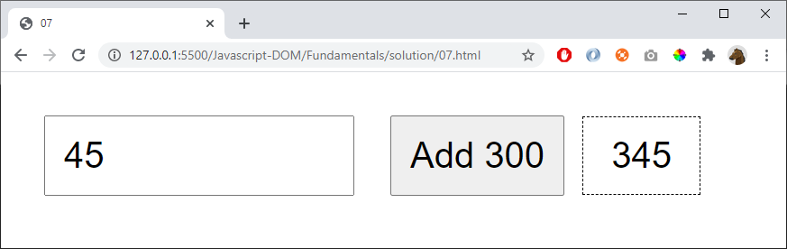

# 07

Add 300 to the number

## Hint

Convert a string to a number

    let myNumber = parseFloat(someVariable)

Convert a number to a string

    let myString = someVariable.toString()

## Extra

Update the number to the right on every keypress