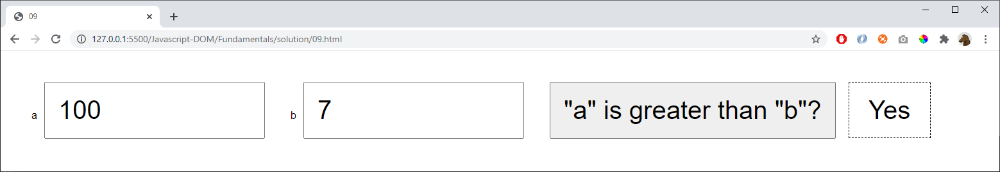

# 09

Check if a is greater than b. Respond with:
- Yes
- No
- Equal

## Extra

When the button is pressed change the button's text to:

    "b" is greater than "a"?

...and the button should work as expected.

If it's pressed once more the text is changed back again.
