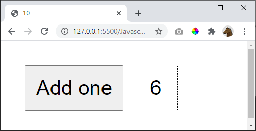

# 10

Start with the number 1. When the button is pressed add one

## Hint

Create one variable "outside" of your function. Now this variable won't be destroyed after *addOne* has been executed.

    let number = 1

    function addOne() {

        ...

    }

## Extra

If the button is pressed many times during a period of 500ms => just add once