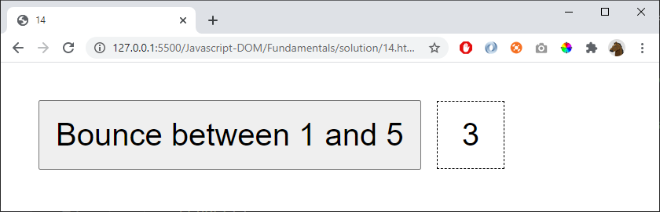

# 14 - Extra

Start with the number 3

Add one to the number. After the number 5 "bounce back" to 1 (4,3,2,1) then "bounce" again (2,3,4...)

## Extra

Show a ball (or similair) that is displayed on different levels depending on the value (1,2,3,4,5)