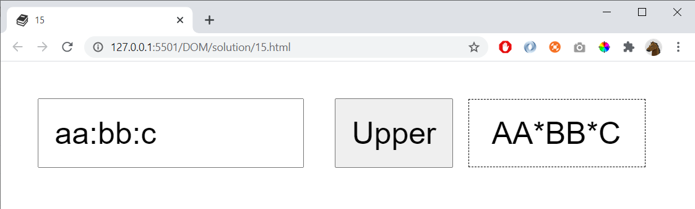

# 15

The list of words to the left is separated with colon (:)

The resulted list of words should be separated with star (*). And uppercase

If the user don't enter any value (or just spaces) then write

    Field is empty :(

If the user just enter one word then write:

    Insert more than one word

## Extra

Display a message if one on the words is empty. E.g:

    what:does:   :the:fox

...should display

    One of the words is empty

