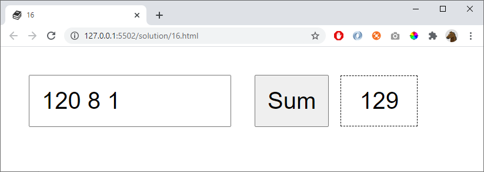

# 16

The user enters a space-separated list of (whole) numbers:

When the button is pressed, sum the numbers

## Extra 1

If the user don't enter any number (or just spaces) then write

    Field is empty :(

If the user just enter one number

    Insert more than one number

## Extra 2

If one of the numbers in the list is not a number, then display a message. E.g this input:

    7 Abc 30 80

...should give an error message    

