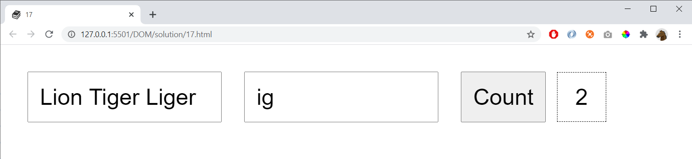

# 18

The first field contains a list of words (separated with space)

Count how many words that contain the text in the second field:

## Extra

Add a checkbox and make it possible to choose if casing (uppercase/lowercase) is considered during counting