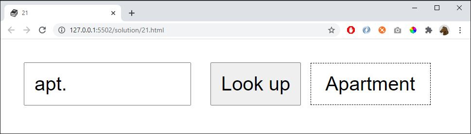

# 21

Look up the meaning of an abbreviation:

Use a **Map**:

    const dictionary = new Map()

...and fill the dictionary with the following words:

    apt   => Apartment 
    dept  => Department
    min   => Minimum
    tel   => Telephone
    tlf   => Telephone 

If the dictionary don't contain the entered abbrevation give an error message:

    "Dictionary don't contain that abbreviation"

## Extra 1

Allow the user to enter a dot at the end of the abbrevation. Both these words should give the result *Apartment*

    apt
    apt.

But these should not be allowed and give error message:

    apt..
    a.pt
    aptx
   
## Extra 2

Refactor the code: create small functions to reduce repeating code and make it simpler to read
