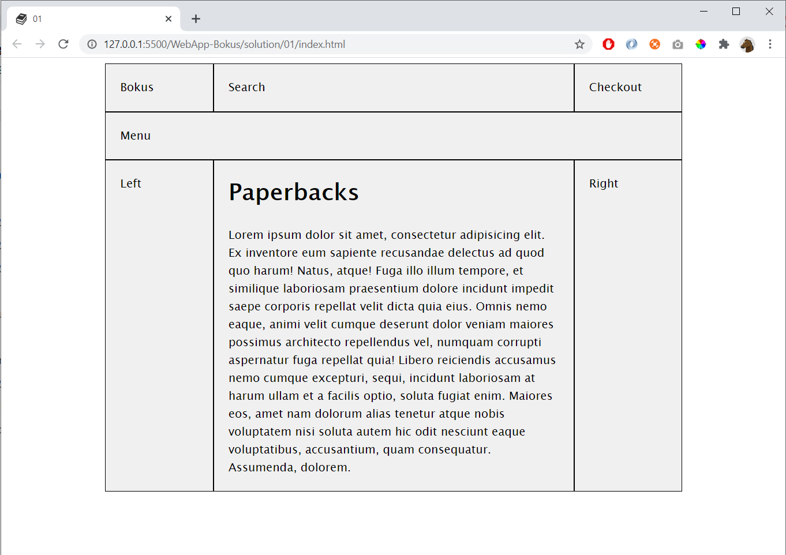

# 01

Create HTML and CSS for this design:

## Hint

Create one **index.html** file and one **main.css** file

To include a stylesheet:

    <link rel="stylesheet" href="main.css">

If you want a **fav icon** use:

    <link rel="shortcut icon" href="....">

To **center** the page, wrap everything in

    

        ....
    

...and add this CSS:    

    .main {
        width:800px;
        margin:0 auto;
    }

To create the layout use **CSS Grid**. Look at the following CSS-properties:
    
    display:grid
    grid-template
    grid-template-columns
    grid-area

A good example of a CSS-grid:

https://www.w3schools.com/cssref/tryit.asp?filename=trycss_grid-template2    