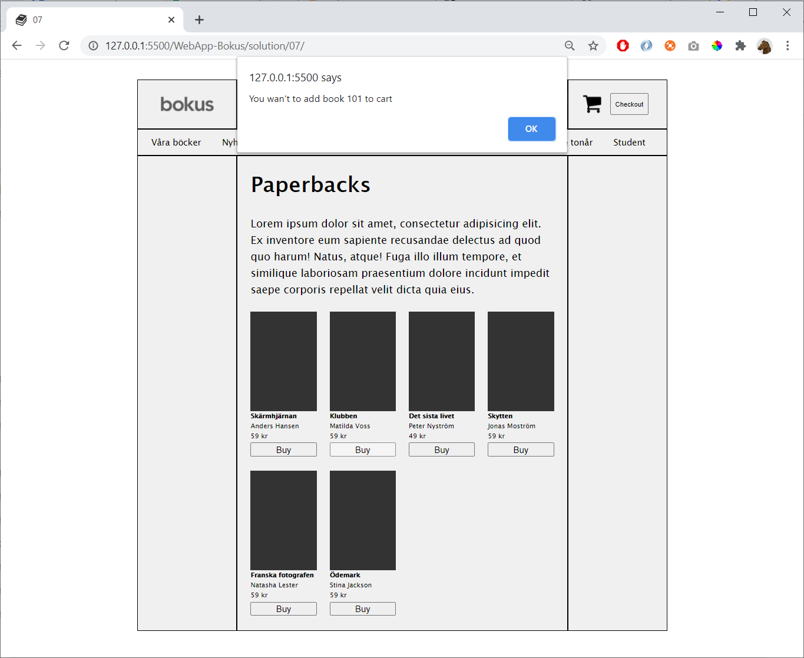

# 07

Create a file **main.js** 

Create a javascript-array with the books:

    const books = [
        { id: 100, title: "xxxxxx",  ... },
        { id: 101, title: "xxxxxx",  ... },
        { id: 102, title: "xxxxxx",  ... },
    ]

Create a function **render()** that insert the books in the HTML (from your variable **books**)

    function render() {

    }

When the user press one of the **buy**-buttons => display an alert message

## Hint

To display an alertbox

    alert("Some message")

To get an element:

    const myElement = document.getElementById("xxxxxx")

To change the HTML inside of an element:    

    document.getElementById("xxxxxx").innerHTML = "
Some HTML code
"
