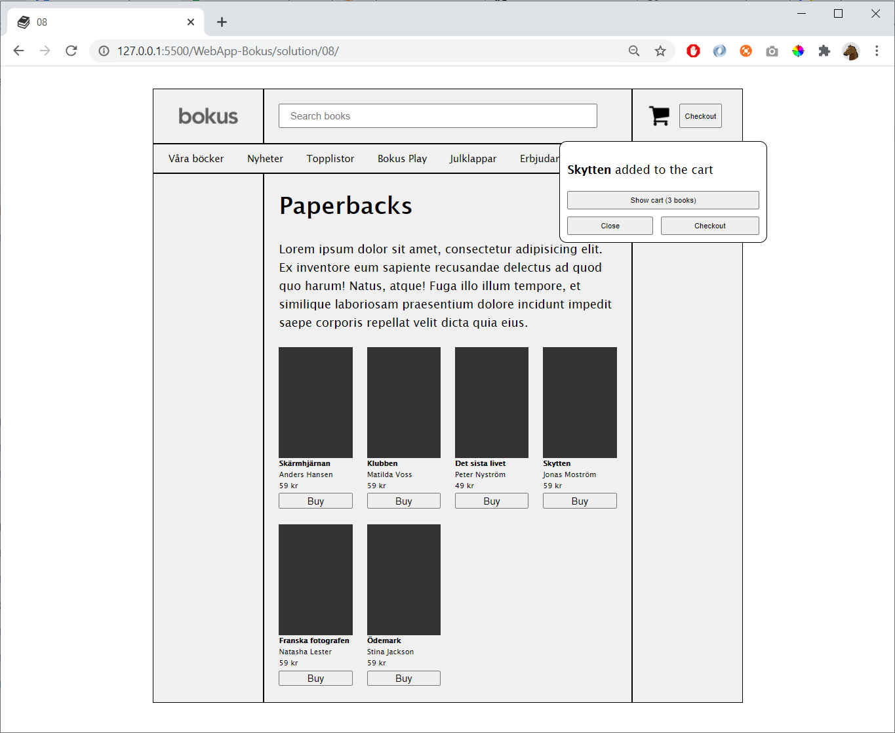

# 08

Here the user has pressed buy-buttons three times:

As you see the last book should be displayed in the popup

Detail: write 1 book and 2 books

If **Close** is pressed then hide the popup

## Hint

Create an array for the cart

    const cart = []

To display an element

    document.getElementById("xxxxx").style.display = "block"    

To hide an element    

    document.getElementById("xxxxx").style.display = "none"    
