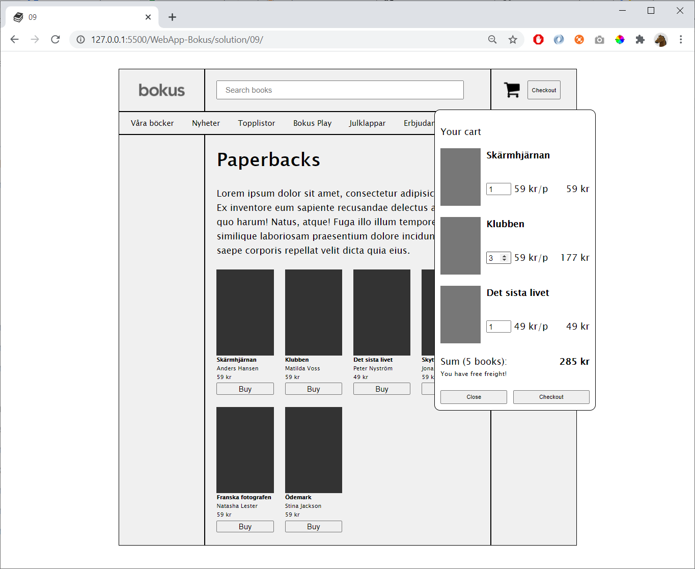
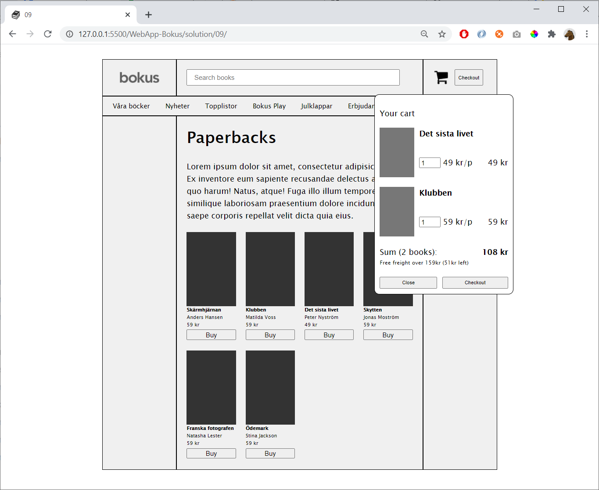

# 09

Add the cart:

When user change the amount of books, the sums etc should be updated right away

It shouldn't be possible to write invalid values in the book-quantiy-boxes (e.g negative value)

The cart can be accessed from **Show cart**-button and the cart-image

If the order is more than 159kr (or equal) then there will be free freight. If not, then display how much to order until free freight:

## Hint

Change the cart from a list to a **Map**:

    const cart = new Map()

